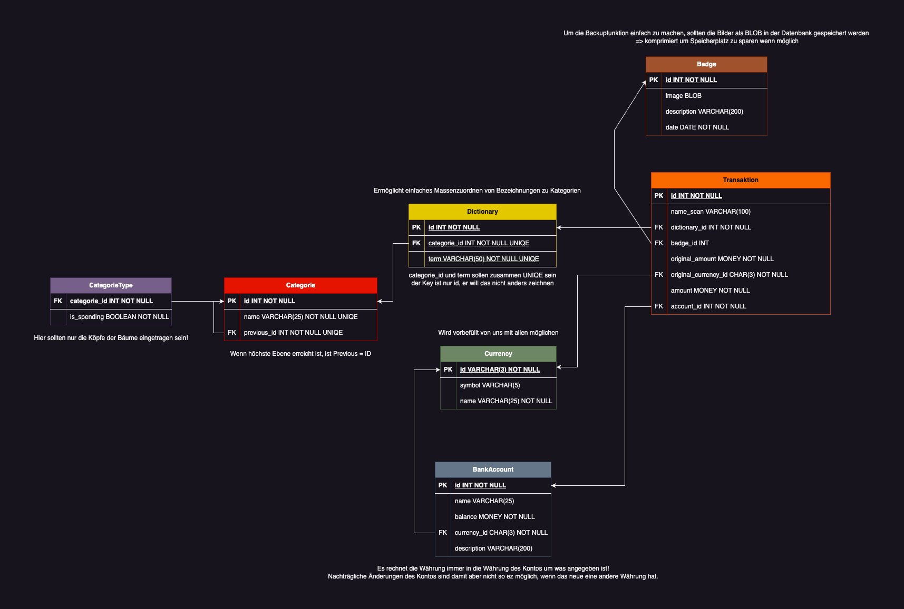

= Architecture Notebook: {project-name}
Vorname Nachname <email@domain.org>; Vorname2 Nachname2 <email2@domain.org>; Vorname3 Nachname3 <email3@domain.org>
{localdatetime}
include::../_includes/default-attributes.inc.adoc[]
// Platzhalter für weitere Dokumenten-Attribute

== Zweck
Dieses Dokument beschreibt die Philosophie, Entscheidungen, Nebenbedingungen, Begründungen, wesentliche Elemente und andere übergreifende Aspekte des Systems, die Einfluss auf Entwurf und Implementierung haben.

//Hinweise: Bearbeiten Sie immer die Abschnitte 2-6 dieser Vorlage. Nachfolgende Abschnitte sind empfohlen, aber optional und sollten je nach Umfang der künftigen Wartungsarbeiten, Fähigkeiten des Entwicklungsteams und Bedeutung anderer architektureller Belange.

//Anmerkung: Die Architektur legt wesentliche EINSCHRÄNKUNGEN für den Systementwurf fest und ist ein Schlüssel für die Erfüllung nicht-funktionaler Eigenschaften!

== Architekturziele 
//Hinweise: Beschreiben Sie den zentralen Ansatz für ihre Architektur. Identifizieren Sie alle Aspekte, die die Philosophie beeinflussen, z.B. komplexe Auslieferung Aspekte, Anpassung von Altsystemen oder besondere Geschwindigkeitsanforderungen. Muss es besonders robust sein, um eine langfristige Wartung und Pflege zu ermöglichen?

//Formulieren Sie eine Reihe von Zielen, die die Architektur in ihrer Struktur und ihrem Verhalten erfüllen muss. Identifizieren Sie kritische Fragen, die von der Architektur adressiert werden müssen, z.B. besondere Hardware-Abhängigkeiten, die vom Rest des Systems isoliert werden sollten oder Sicherstellung der Funktionsfähigkeit unter besonderen Bedingungen (z.B. Offline-Nutzung).
- Entwicklung einer plattformübergreifenden mobilen Anwendung (iOS, Android, Web).
- Moderne, nutzerfreundliche und übersichtliche Benutzeroberfläche.
- Einfache Erweiterbarkeit für zukünftige Integration eines Backends.
- Leichte Wartbarkeit und Weiterentwicklung durch komponentenbasierten Aufbau.
- Fokus auf schnelle Entwicklung durch Nutzung von Expo und React Native.
- Unterstützung für unterschiedliche Geräte und Betriebssysteme.
- (Geplant) Synchronisation und Datenspeicherung über ein Backend-System.
- Minimale Abhängigkeiten, hohe Portabilität und offline/online Nutzung.

== Annahmen und Abhängigkeiten
//[List the assumptions and dependencies that drive architectural decisions. This could include sensitive or critical areas, dependencies on legacy interfaces, the skill and experience of the team, the availability of important resources, and so forth]
- Das Entwicklungsteam hat Kenntnisse in JavaScript/TypeScript und React Native.
- Die App wird aktuell als reines Frontend mit React Native und Expo entwickelt.
- Backend-Integration und Datenspeicherung sind als nächste Schritte geplant.
- Jeder Nutzer besitzt ein mobiles Endgerät (iOS oder Android) oder kann die Web-Version verwenden.
- Expo ermöglicht schnelle Entwicklung und Testing auf verschiedenen Plattformen.

== Architektur-relevante Anforderungen
//Fügen Sie eine Referenz / Link zu den Anforderungen ein, die implementiert werden müssen, um die Architektur zu erzeugen.
- Plattformunabhängigkeit (Android, iOS, Web)
- Offline-Funktionalität (soweit möglich mit lokalem Speicher)
- Übersichtliche und performante Benutzeroberfläche
- Klare Trennung zwischen UI, Logik und (zukünftig) Datenhaltung
- Einfache Erweiterung um zukünftige Schnittstellen (z.B. REST API)
- Vorbereitung für spätere Daten-Synchronisation zwischen Geräten

== Entscheidungen, Nebenbedingungen und Begründungen
//[List the decisions that have been made regarding architectural approaches and the constraints being placed on the way that the developers build the system. These will serve as guidelines for defining architecturally significant parts of the system. Justify each decision or constraint so that developers understand the importance of building the system according to the context created by those decisions and constraints. This may include a list of DOs and DON’Ts to guide the developers in building the system.]

* **Frontend-Framework:** React Native in Kombination mit Expo ermöglicht schnelle Entwicklung, Testing und Deployment auf mehreren Plattformen.
* **Styling:** TailwindCSS (über Nativewind) sorgt für einheitliches, modernes Styling und produktive Entwicklung von UI-Komponenten.
* **Navigation:** Implementierung mit React Navigation für eine flexible und modulare Navigationsstruktur innerhalb der App.
* **Datenhaltung:** In der ersten Version ausschließlich lokal (z.B. AsyncStorage, Expo-Speicherlösungen), Backend-Anbindung geplant.
* **Backend:** Noch nicht umgesetzt, Anbindung an REST API vorgesehen.
* **Plattformstrategie:** Fokus auf plattformübergreifende Nutzung (iOS, Android, Web) ohne spezielle Hardwareabhängigkeiten.
* **Testing:** Nutzung von Expo-Tools für einfaches Testen und Debugging.

== Schichten oder Architektur-Framework
//[Describe the architectural pattern that you will use or how the architecture will be consistent and uniform. This could be a simple reference to an existing or well-known architectural pattern, such as the Layer framework, a reference to a high-level model of the framework, or a description of how the major system components should be put together.]
- Präsentationsschicht: React Native-Komponenten (UI, Screens)
- Logikschicht: State Management, Datenverarbeitung, Navigation
- (zukünftig) Datenschicht: Anbindung an Backend-API für Speicherung und Synchronisation

== Architektursichten (Views)
//[Describe the architectural views that you will use to describe the software architecture. This illustrates the different perspectives that you will make available to review and to document architectural decisions.]

=== Kontextabgrenzung
//Level 1 im C4-Modell
Das System "Spendex" ist eine plattformübergreifende Finanz-Tracking-App, die Nutzern ermöglicht, Ausgaben und Einnahmen zu verwalten, zu kategorisieren und statistisch auszuwerten. Die App läuft auf iOS, Android und im Web und richtet sich an Endnutzer, die ihre Finanzen unkompliziert überwachen möchten.

- **Systemgrenze:** Die mobile App (Frontend) ist die zentrale Komponente. Externe Systeme wie Backend-APIs oder Datenbanksysteme sind für zukünftige Releases vorgesehen.
- **Akteure:** Nutzer (Endanwender), ggf. Backend/Sync-Dienst (zukünftig)
- **Umgebung:** Mobile Geräte (iOS, Android), Webbrowser

=== Container
//Level 2 im C4-Modell
Die Architektur besteht aktuell aus einem Haupt-Container – der mobilen App – die mit React Native (Expo) umgesetzt ist. Die wichtigsten Container sind:

- **Mobile App (Frontend):**
  - Implementiert mit React Native und Expo.
  - Beinhaltet alle UI-Komponenten, State-Management und lokale Speicherung der Daten.
  - Verwendung von Expo-Modulen und React Navigation für plattformübergreifende Funktionen.
  - Möglichkeit zur Offline-Nutzung.
- **(Geplant) Backend-API:**
  - Noch nicht umgesetzt, in zukünftigen Versionen vorgesehen.
  - Zuständig für Synchronisierung, Speicherung, Benutzerverwaltung etc.

=== Components
//Level 3 im C4-Modell
Die wichtigsten Komponenten innerhalb des Frontend-Containers sind:

- **Layout-Komponente (`_layout.tsx`):**  
  Steuerung der globalen Navigationsstruktur (z.B. Tab-Navigation).
- **Tabs-Komponenten:**  
  Organisieren die verschiedenen Hauptbereiche der App (z.B. Dashboard, Neue Transaktion, Statistiken).
- **Screens:**  
  Einzelne Ansichten zur Erfassung und Darstellung von Daten, wie Transaktionsübersicht, Kategorien, Konten, Badges etc.
- **Service-Komponenten:**  
  Kapseln die Datenhaltung (zunächst lokal, später via API).
- **Datenmodelle:**  
  Repräsentiert durch die im ER-Diagramm dargestellten Entitäten:  
  CategoryType, Category, Dictionary, Currency, BankAccount, Transaction, Badge

Die logische Struktur und Beziehungen zwischen diesen Entitäten sind im folgenden ER-Diagramm visualisiert:

=== Verteilungsdiagramm (Deployment Diagramm)
//Beschreibt die physischen Knoten (Rechner) des Systems und Komponenten, die in diesen Knoten ausgeführt werden. Diese Sicht wird nicht benötigt, wenn das System in einem einzelnen Prozess oder Thread ausgeführt wird.
Das System läuft aktuell ausschließlich auf den Endgeräten der Nutzer (Mobile App auf iOS/Android oder im Webbrowser).  
Es gibt keine verteilten Backend-Komponenten oder Serverprozesse im aktuellen Entwicklungsstand.  
Die gesamte Datenhaltung erfolgt lokal auf dem Gerät, wodurch die App offline-fähig bleibt.

- **Physische Knoten:**  
  - Mobilgerät des Nutzers (iOS, Android)
  - Webbrowser (bei Nutzung der Web-App)
- **Geplante Erweiterung:**  
  In zukünftigen Versionen ist die Anbindung an einen externen Backend-Service (z.B. Cloud-Datenbank) vorgesehen. Diese würde als zusätzlicher Knoten in der Infrastruktur auftreten.

